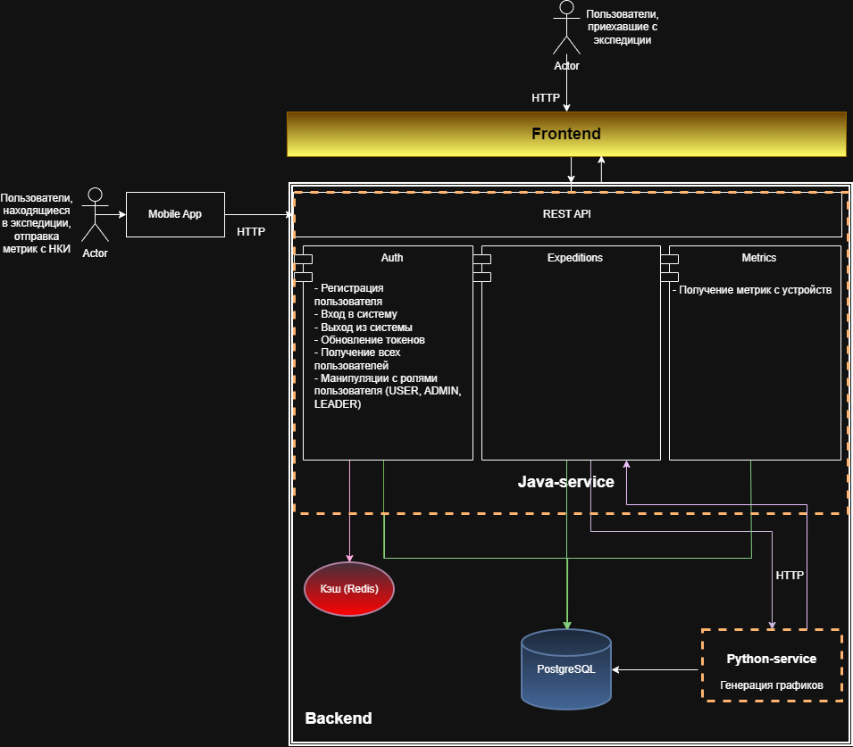

# 🧊 Arctic Expedition Metrics Platform

## 🌟 О проекте
Данный проект представляет собой Java бэкенд-часть веб-приложения для мониторинга психофизиологического состояния участников арктических экспедиций. 

Система собирает и анализирует данные с нейроинтерфейсов (далее - НКИ), предоставляя участникам экспедиций, их руководителям и администраторам понятные графики для оценки состояния и своевременного реагирования на критические изменения для предотвращения ошибок, которые в условиях экспедиции могут быть критическими.

Предполагается, что участники экспедиций будут регулярно (например, три раза в день) будут надевать НКИ, и полученные метрики будут сохраняться в БД локально на мобильном устройстве для отправки на сервер


##  🏗 Архитектура

Всего глобально в проекте пять основных компонентов:
- нейроинтерфейс, который надевает человек в экспедиции;
- мобильное приложение, принимающее метрики с нейроинтерфейса;
- REST API Java (основной сервис, выполняющий основную логику);
- REST API Python-микросервис (используется для генерации графиков и аналитики, для аналитики используется GigaChat API);
- клиентская часть веб-приложения.

### 🌟 Также стоит упомянуть основные процессы для понимания системы:
1) пользователь, находящийся вне экспедиции (либо просто в условиях стабильного интернета), может зайти в веб-приложение и в зависимости от его ролей может:
#### ROLE_USER:
- просмотр всех экспедиций, в которых он участвовал
- просмотр графиков конкретной экспедиции
#### ROLE_LEADER:
- создание экспедиций и манипуляции с ними (в том числе создание участников и дальнейшие манипуляции)
- просмотр экспедиций, где пользователь просто участник и где лидер; в экспедициях, где у него роль - лидер, может просматривать графики всех участников экспедиции
#### ROLE_ADMIN:
- просмотр админ-панели с возможностью управления ролями пользователей системы
2) мобильное приложение пользователя, находящегося в экспедиции в условиях нестабильного интернет-соединения, при появлении соединения отправляет накопленные метрики на сервер

### 🌟 Архитектурная диаграмма системы (включая внутренние компоненты Java-микросервиса) представлена на рисунке 1.


Рисунок 1 - архитектурная диаграмма системы

## 🛠 Технологический стек серверной-части Java:
- Java 21
- Spring Boot 4 (starters: Data Jpa, Security, Web)
- Lombok
- Хранилища данных: PostgreSQL, Redis
- Миграции Flyway
- Docker-контейнеризация (docker-compose)
- Swagger/OpenAPI документация

## 🌟 Решения и размышления
На данном этапе разработки думаю насчет изменения реализации выгрузки метрик, сейчас используется batch-выгрузка метрик в БД. Думаю поменять на Spring JdbcTemplate, чтобы убрать накладные расходы на управление кэшем и генерацию SQL, так как данных с НКИ по одной метрике за одну маленькую двухминутную сессию около 1.5 тысячи (всего метрик 22 + сессия >2минут + большое количество участников).

## 🌟 Дополнительно
- Используется JWT-авторизация (хранение refresh-токена в Redis c TTL на 7 дней + access-токен с хранением на клиенте (инвалидация через blacklist Redis))

## 🌟 Запуск (Java back-части)
```
git clone https://github.com/Egor12344321/backend_arctic_team.git
cd backend_arctic_team
mvn package
docker-compose up -d
```


